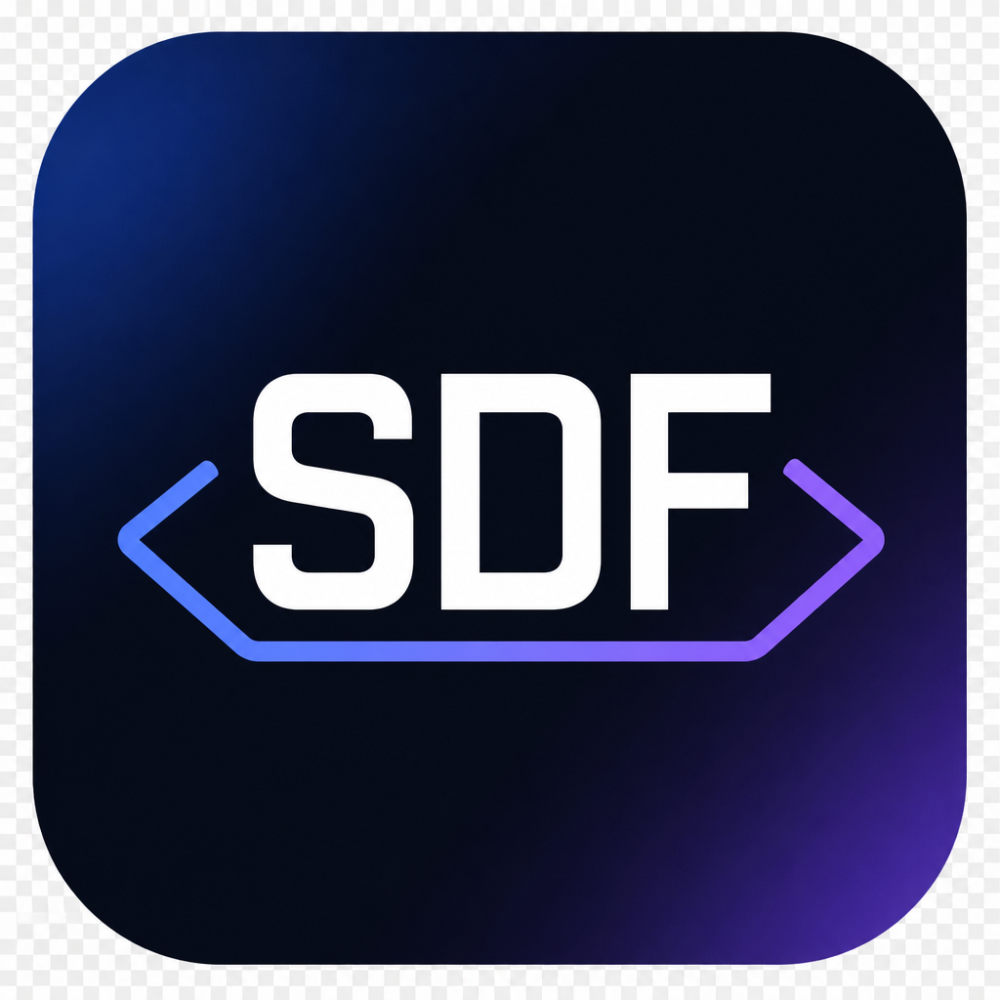
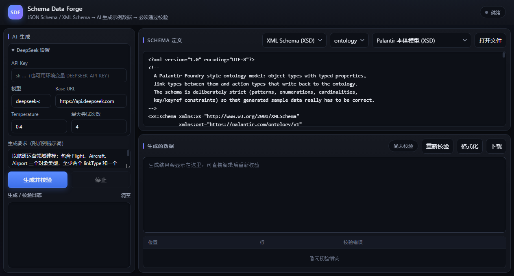
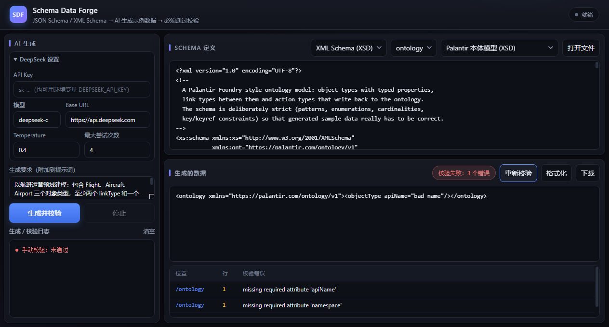

<p align="center"></p>

# Schema Data Forge

桌面示例数据生成器：给定 **JSON Schema** 或 **XML Schema (XSD)**，调用 DeepSeek 以结构化输出生成示例数据，
并且**必须通过 schema 校验**才算成功——校验失败时把逐条校验错误回灌给模型自动修复，直到通过或达到最大尝试次数。

内置示例使用 Palantir Foundry 风格的本体模型（object type / link type / action type）XSD。

## 下载安装（免装 Python）

到 [Releases](https://github.com/gatesenman/schema-data-forge/releases) 页面下载对应平台的安装包，解压后双击即可运行：

| 平台 | 文件 | 说明 |
| --- | --- | --- |
| Windows | `SchemaDataForge-windows.zip` | 解压后双击 `SchemaDataForge.exe`（需要 WebView2 Runtime，Win10/11 一般自带） |
| macOS | `SchemaDataForge-macos.zip` | 解压后把 `SchemaDataForge.app` 拖到应用程序；首次打开若被拦截，右键 → 打开 |
| Linux | `SchemaDataForge-linux.zip` | 解压后运行 `./SchemaDataForge`（缺 WebKitGTK 时自动回退到默认浏览器） |

## 界面





- **左侧：AI 面板** — DeepSeek API Key、模型、Base URL、temperature、最大尝试次数；生成要求（追加到提示词）；
  生成按钮与生成/校验日志（每一次尝试的校验结果）。
- **右上：Schema 定义** — schema 类型（XSD / JSON Schema）、XSD 根元素、示例选择、打开本地文件。
- **右下：生成的数据 + 校验结果** — 可直接编辑并「重新校验」「格式化」「下载」；下方列出每条校验错误的位置、行号与信息，
  点击可跳到对应行。

## 运行

```bash
uv venv --python 3.12
uv pip install -e ".[dev]"

# Web UI（浏览器打开 http://127.0.0.1:8765）
DEEPSEEK_API_KEY=sk-... .venv/bin/python -m schema_data_forge.web

# 桌面窗口模式（需要 uv pip install -e ".[desktop]"，缺少 pywebview 时回退到默认浏览器）
DEEPSEEK_API_KEY=sk-... .venv/bin/python -m schema_data_forge.desktop

# 无界面（脚本 / CI 用）
DEEPSEEK_API_KEY=sk-... .venv/bin/python -m schema_data_forge.cli \
    --example palantir_ontology.xsd --out sample.xml
```

Windows PowerShell 下把 `.venv/bin/python` 换成 `.venv\Scripts\python.exe`，
用 `$env:DEEPSEEK_API_KEY="sk-..."` 设置密钥。API Key 也可以直接填在左侧面板里（仅存在浏览器 `localStorage`，不入库）。

后端接口：`GET /api/examples`、`POST /api/root-elements`、`POST /api/validate`、`POST /api/format`、
`POST /api/generate`（SSE：`start` / `attempt` / `done` / `error`，每次尝试的校验结果实时推送到左侧日志）。

## 工作原理

1. `generator.build_initial_messages` 把 schema、根元素、目标命名空间和用户额外要求组装成提示词，
   并要求模型用 JSON 信封返回（`{"data": ...}` 或 `{"xml": "..."}`），配合 DeepSeek 的 `response_format=json_object`
   保证结构化输出。
2. `validation.validate` 用 `jsonschema`（Draft 2020-12）或 `xmlschema` 校验，产出带位置/行号的错误列表。
3. 未通过时 `generator.build_repair_message` 把错误列表作为下一轮的修复指令，保留对话上下文继续修，
   直到通过（`GenerationResult.succeeded`）或用尽 `max_attempts`。未通过时 `document` 为 `None`，绝不返回未校验的数据。

## 示例 schema

| 文件 | 说明 |
| --- | --- |
| `src/schema_data_forge/example_schemas/palantir_ontology.xsd` | Palantir 本体模型：apiName 正则、dataset RID 正则、枚举、cardinality、`xs:key`/`xs:keyref`（link/action 必须引用已定义的对象类型）、属性 apiName 唯一性约束 |
| `src/schema_data_forge/example_schemas/palantir_object_set.schema.json` | 本体对象集合（Draft 2020-12）：`$defs`、`pattern`、`enum`、`uniqueItems`、`dependentRequired`、`additionalProperties: false` |

## 测试

```bash
.venv/bin/python -m pytest -m "not e2e"   # 单元测试：校验器 + 生成重试循环（无网络）
DEEPSEEK_API_KEY=sk-... .venv/bin/python -m pytest -m e2e   # 端到端：真实调用 DeepSeek
```

端到端测试断言 DeepSeek 生成的 XML/JSON 通过对应 schema 校验；没有设置 `DEEPSEEK_API_KEY` 时自动跳过。

## 代码检查

```bash
.venv/bin/python -m ruff check .
.venv/bin/python -m ruff format --check .
.venv/bin/python -m mypy
```
